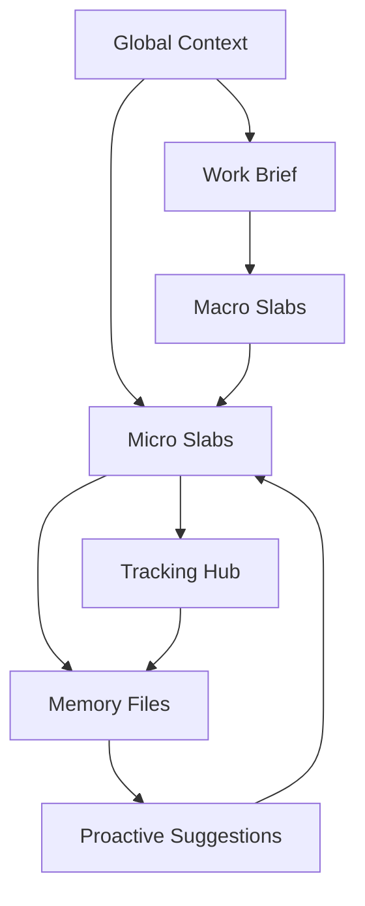

# Slabs Concepts

## The Model



Slabs is built around a simple hierarchy, two supporting feedback systems, and
one workspace-wide reference layer.

- The hierarchy:
  - Work Brief
  - Macro Slabs
  - Micro Slabs
- The feedback systems:
  - Work Tracking
  - Memory and Proactive Suggestions
- The shared layer:
  - Global Context

In a local Slabs workspace, that model is usually embodied under:

```text
projects/<project-slug>/
```

where the brief, tracking hub, slabs, memory, and supporting context live together.

In this repo, `projects/slabs-foundation/` is the tracked example. Additional
project folders under `projects/` and additional notes under `global-context/`
are gitignored by default so users can clone the framework and work locally
without publishing personal workspace state.

## Work Brief

The work brief is the canonical hub for an initiative.

In the current default Slabs workflow, the live work brief usually lives in
Google Docs, while the local project folder may store only its URL in
`brief-link.txt`.

It should answer:

- What are we doing?
- Why are we doing it?
- What does success look like?
- What are the major work buckets?
- What artifacts and deliverables are being produced?

A good work brief is stable enough to anchor the initiative but flexible enough to grow as the work evolves.

## Macro Slabs

Macro slabs are the highest-level buckets of work required to complete the brief.

Each macro slab should:

- represent a meaningful outcome area
- stay broad enough to include multiple execution tasks
- make sense as a progress bucket in its own right
- have a clear relationship to the success criteria in the brief

Macro slabs are not meant to be giant checklists. They are strategic containers.

## Micro Slabs

Micro slabs are the atomic execution units for Codex sessions.

Each micro slab should:

- be small enough for one focused session whenever possible
- have one clear primary goal
- require limited context to restart
- produce a concrete output, decision, or artifact
- link back to its parent macro slab

Micro slabs are where the person and Codex actually do the work together.

## Work Tracking

The tracking hub is the rollup layer for progress.

It should summarize:

- macro slab status
- active and completed micro slabs
- key decisions
- linked artifacts
- blockers, risks, and next actions

The tracking hub should help someone answer, at a glance, "Where does the work stand right now?"

## Memory Files

Memory files capture durable context for future sessions and future agents.

They should hold concise information such as:

- decisions that matter later
- assumptions that shaped the work
- artifacts produced
- what changed
- what is next

Memory files are intentionally narrower than the full chat history. Their job is to preserve the signal.

In the canonical local workspace, memory files usually live under:

```text
projects/<project-slug>/memory/
```

Longer-lived supporting notes that are still worth keeping close to the work, but are not session memory snapshots, usually live under:

```text
projects/<project-slug>/context/
```

This keeps durable memory distinct from broader project reference material.

## Global Context

Some reference material matters across several projects instead of only one.

Good examples include:

- GitHub repositories used by multiple initiatives
- shared environments or account references
- reusable system notes
- workspace-wide naming or taxonomy rules

That material should live once at the workspace root under:

```text
global-context/
```

This keeps project-level `context/` folders focused on project-specific notes
while still giving the workspace a durable place for shared reference material.

## Proactive Suggestions

Proactive suggestions are candidate micro slabs generated during off-hours by Codex automations or related workflows.

The goal is not to auto-execute work without review. The goal is to surface high-quality next actions so the user can begin the day with momentum.

Good proactive suggestions should:

- be clearly framed
- be traceable to the work brief and macro slabs
- reflect the current state of tracking and memory
- be easy for a human to accept, reject, or refine

When stored on disk, they usually live under:

```text
projects/<project-slug>/suggestions/
```

## Slab Quality Bar

Use these rules of thumb:

- One brief per initiative.
- Usually 3-7 macro slabs per brief.
- Micro slabs should feel finishable, not sprawling.
- Tracking should be updated on meaningful state change.
- Memory should preserve durable context, not stream-of-consciousness notes.
- Suggestions should be helpful starting points, not hidden automation behavior.
